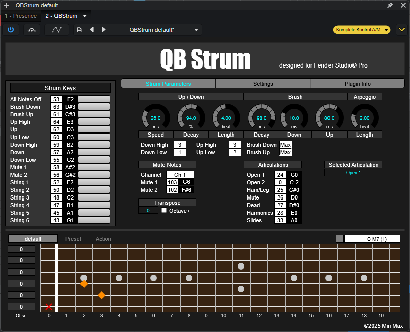

# QBStrum

Studio One(Fender Studio Pro)で使用する  
**ギター用ストラム／コード演奏支援 VST3 プラグイン**です。

---

## 概要 | Overview

QBStrum は、  
**コード指定 + ストラム／ブラッシング操作**を MIDI レベルで制御する  
ギター演奏支援プラグインです。

コード、ボイシング、ストラム方向、ブラシ、ミュート、  
アルペジオ、アーティキュレーションなどを  
**KeySwitch とパラメータ操作**で統合的に扱えます。

---

## 対応環境 | System Requirements

- OS: **Windows**
- DAW: **VST3 対応 DAW**
  - 動作確認：Studio One 7,Fender Studio Pro 8
- ギター音源（別途必要）
  - Ample Guitar などの MIDI 入力対応音源

---

## ダウンロード・インストール | Download & Installation

### 手順 | Steps

1. このページ右側の **Releases** から最新版をダウンロードします。  
2. ダウンロードした zip を任意の場所に展開します。  
3. 展開されたフォルダ内の **VST3 プラグイン**を  
   DAW の VST3 プラグインフォルダへ配置します。

---

## 付属プリセットファイル | Preset Files

Release 用 zip には、`Presets` フォルダ内に  
以下の **3 つのリソースファイル**が含まれています。

| ファイル名 | 内容 |
|-----------|------|
| `default.qbs` | デフォルトでロードされる **コードマップ**（JSON 形式） |
| `QBStrum.pitchlist` | ピッチ名定義ファイル（ドラムマップ／ノート名表示用） |
| `QBStrum.keyswitch` | **コード指定用 KeySwitch 定義ファイル** |

---

## リソースファイルの役割と配置先 | Notes & Preset Installation

- `default.qbs`  
  - 初回起動時に **自動ロード**されるコードマップ  
  - ユーザー編集・差し替え可能
  - 配置：ユーザーフォルダ\Documents\VST3 Presets

- `QBStrum.keyswitch`  
  - **コード指定・切り替え操作**用の KeySwitch 定義
  - 配置：Studio Oneのユーザープリセットフォルダ内Key Switches

- `QBStrum.pitchlist`  
  - DAW 側の **ノート名／ドラムマップ表示**に使用  
  - 配置：Studio Oneのユーザープリセットフォルダ内Pitch Names

---

## 注意事項 | Notes

- QBStrum は **Studio One(Fender Studio Pro) 専用です、  
- 本プラグインは **MIDI 処理を主目的**としており、  
  オーディオ信号は生成しません。

---

## 免責事項 | Disclaimer

本ソフトウェアは無償で提供されます。  
本ソフトウェアの使用または使用不能から生じる  
いかなる損害についても、作者は一切の責任を負いません。
本ソフトウェアは予告なく提供を中止することがあります。

---

## 📄 ライセンス | License

MIT License
